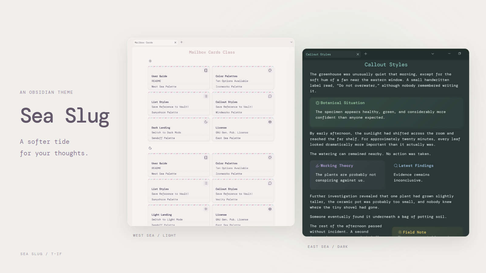

# Sea Slug

Soft colors, flexible callouts, and styled Bases. A practical remix of [Chime](https://github.com/Bluemoondragon07/chime-theme) for Obsidian 1.13+. [Style Settings](https://github.com/mgmeyers/obsidian-style-settings) is recommended.




## Differences from Chime

- Updated for current Obsidian layouts, callouts, and plugins.
- Adds inactive-pane dimming, hover-expanding ribbon, dark-mode media dimming, list and outline threading, seamless embeds, and banners.
- Builds in list grids/cards, tree lists, floating and multi-column callouts, alternate checkboxes, and priority tags.
- Adds styling for Bases, Commander, Calendar, and Kanban.
- Removes Chime's legacy layouts, background images, `wiki-page`, `novel`, outdated color schemes, Page Gallery, and other obsolete plugin rules.
- Everything else is labeled under `Obsidian Settings → Style Settings → Sea Slug`.

## Styling Guide

- Preview static note pages [here](https://share.note.sx/93dfz98e). 
- Preview the available color schemes [here](/palettes).

### Page Classes

Add these under the note's `cssclasses` property.

| Use      | Classes                                                                                  |
| -------- | ---------------------------------------------------------------------------------------- |
| Width    | `width-800`, `width-900`, `width-1000`, `width-1200`, `width-1600`             |
| Cleanup  | `no-backlinks`, `no-count`, `no-fold`, `clean-embed`                             |
| Banners  | `banner`, `banner-fade`                                                              |
| Bases    | `no-head`, `case-card`, `center-card`, `oneline`, `no-fade`, `mailbox-cards`, `pcbox`, `musicshelf` |
| Text     | `colorful-headings`, `colorful-headings-alt`, `underlined-highlight`               |
| Headings | `h1-center`–`h6-center`, `h1-bottom-border`–`h6-bottom-border`                 |

`aside-left` and `aside-right` are HTML element classes for margin notes, not page classes.

### Bases

Add classes to the note containing the embedded Base, then select a Cards view in the Base. They style the view, not the individual notes listed in it. Classes affect all Bases embedded in that note.

```markdown
---
cssclasses: [pcbox, no-fade]
---


![[Collection.base]]
```

| Class           | Effect                                                                                                   |
| --------------- | -------------------------------------------------------------------------------------------------------- |
| `pcbox`         | Collection cards with centered titles and a gentle hover lift.                                           |
| `musicshelf`    | Album-style covers with a vinyl record behind them; configure an image/cover property in the Cards view. |
| `mailbox-cards` | Airmail cards with hidden property labels; stays fully opaque. See the property names below.             |
| `no-fade`       | Keeps other card styles fully opaque without hovering.                                                   |
| `no-head`       | Hides the embedded Base's toolbar/header; also works with other view types.                              |
| `center-card`   | Centers card titles.                                                                                     |
| `oneline`       | Compact label/value columns and centered titles.                                                         |
| `case-card`     | Limits card property text to three lines.                                                                |

In a Card Base view embedded in a note with the cssclass `mailbox-cards`, add these formulas with these exact names in this order:

- `icon`: the stamp row; return the icon you want to display.
- `mailbox-bold`: bold heading text, such as the file name.
- Your other properties: dates, descriptions, etc.
- `mailbox-cards`: the footer with a separator above it.

These are formula names, not display labels; CSS targets `formula.icon`, `formula.mailbox-bold`, and `formula.mailbox-cards`. The styling does not create formulas or calculate dates for you.

### Banners & Images

```yaml
---
cssclasses: [banner, banner-fade]
---
```

```markdown
![[image.jpg|banner]]
```

Image aliases also support `center` and `right`.

### Asides

Put an HTML aside before the paragraph it belongs to:


```html

<aside class="aside-right">A short side note.</aside>

  

Your main paragraph goes here.

```

View in Reading view with Readable line length enabled. Asides sit in the outer margin when the pane is wide enough; in narrower panes, text wraps beside them. Use plain text or HTML inside the aside, rather than Markdown formatting.

### Lists

| Tag                | Result                    |
| ------------------ | ------------------------- |
| `#mcl/list-grid` | Column grid               |
| `#mcl/list-card` | Card grid                 |
| `#tree-view`     | Collapsible threaded tree |

Put the tag inside the list. It is hidden in Reading view.

### Callouts

```markdown
> [!issue] Issue
> What legal question must be resolved?

> [!note|float-right-small] Small floating note
> Text wraps around it.

> [!lucide-scale|custom-icon purple] Custom icon
> Omit the color metadata to use the purple default.
```

| Group        | Types or metadata                                                                                                 |
| ------------ | ----------------------------------------------------------------------------------------------------------------- |
| Legal        | `facts`, `posture`, `issue`, `rule`, `analysis`, `conclusion`, `concurrence`, `dissent`                           |
| Other types  | `email`, `conversation`, `conversation-outline`, `conversation-minimalist`, `timeline`, `polaroid` |
| Custom icon  | `[!lucide-icon\|custom-icon]`; add a color after `custom-icon` when needed                                        |
| Layout types | `blank`, `multi-column`                                                                                           |
| Colors       | `gray`, `brown`, `red`, `orange`, `yellow`, `green`, `cyan`, `blue`, `purple`, `pink`                             |
| Cleanup      | `no-bg`, `no-background`, `no-icon`, `no-title`, `blank`, `wide`, `black-and-white`, `b-w`                        |
| Floats       | `left`, `right`, `float-left`, `float-right`; sized forms: `float-left-small` / `float-right-small` (also `medium`, `large`)                                |
| Timeline     | `horizontal`, `numbered`, `skip`                                                                                  |
| Email        | `sep`                                                                                                             |

### Checkboxes


| Marker | Meaning     | Marker | Meaning   | Tag             | Meaning         |
| ------ | ----------- | ------ | --------- | --------------- | --------------- |
| `/`    | Incomplete  | `-`    | Canceled  | `#A`            | High priority   |
| `>`    | Forwarded   | `<`    | Scheduled | `#B`            | Medium priority |
| `?`    | Question    | `!`    | Important | `#C`            | Low priority    |
| `*`    | Star        | `“`    | Quote     | `#rsvp`         | Recurring       |
| `l`    | Location    | `b`    | Bookmark  | `#show`         | Event           |
| `i`    | Information | `I`    | Idea      | `#productivity` | Productivity    |
| `S`    | Savings     | `p`    | Pro       |                 |                 |
| `c`    | Con         | `f`    | Fire      |                 |                 |
| `k`    | Key         | `w`    | Win       |                 |                 |
| `u`    | Up          | `d`    | Down      |                 |                 |
| `R`    | Rule        | `m`    | ???       |                 |                 |


## Installation

1. Install and enable [BRAT](https://github.com/TfTHacker/obsidian42-brat).
2. Choose `Add a beta theme` and enter `https://github.com/t-if/sea-slug`.
3. Select `Sea Slug` under `Settings → Appearance → Themes`.

BRAT uses `theme-beta.css`. `theme.css` has the same features with my personal defaults.

## Credits & License

Based on [Chime](https://github.com/Bluemoondragon07/chime-theme), with adapted work from [MCL Multi Column](https://github.com/efemkay), [Obsidian Banner Snippet](https://github.com/HandaArchitect/obsidian-banner-snippet), [Fancy-a-Story](https://elsatam.github.io/obsidian-fancy-a-story/), [Minimal](https://github.com/kepano/obsidian-minimal), [r-u-s-h-i-k-e-s-h&#39;s snippets](https://github.com/r-u-s-h-i-k-e-s-h/Obsidian-CSS-Snippets), [Maple](https://github.com/subframe7536/obsidian-theme-maple), and [Adrenaline](https://github.com/Spekulucius/obsidian-adrenaline). Source comments contain detailed attribution.

Licensed under [GPL-3.0-or-later](LICENSE).
